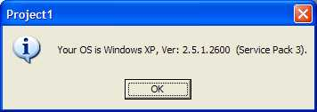



## Detecting OS \(Unicode\) Windows 95 \- Windows 7

### Description

Detecting OS (Unicode) Windows 95 - Windows 7
 
### More Info
 

             |
---                |---
**Submitted On**   |2010-11-05 09:20:02
**By**             |[Jan Andersson](https://github.com/Planet-Source-Code/PSCIndex/blob/master/ByAuthor/jan-andersson.md)
**Level**          |Beginner
**User Rating**    |4.7 (14 globes from 3 users)
**Compatibility**  |VB 4\.0 \(16\-bit\), VB 4\.0 \(32\-bit\), VB 5\.0, VB 6\.0
**Category**       |[Windows System Services](https://github.com/Planet-Source-Code/PSCIndex/blob/master/ByCategory/windows-system-services__1-35.md)
**World**          |[Visual Basic](https://github.com/Planet-Source-Code/PSCIndex/blob/master/ByWorld/visual-basic.md)
**Archive File**   |[Detecting\_2192071152010\.zip](https://github.com/Planet-Source-Code/jan-andersson-detecting-os-unicode-windows-95-windows-7__1-73566/archive/master.zip)

